# 개발 문서
1. [Player](#player)
2. [Status](#status)
3. [Item](#item)
4. [Inventory](#inventory)
5. [UI](#ui)
6. [Enemy](#enemy)

## Player

### Diagram
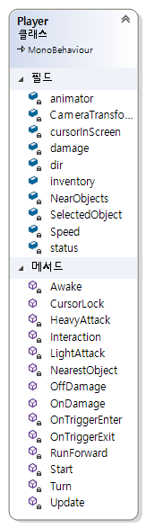
### Animation
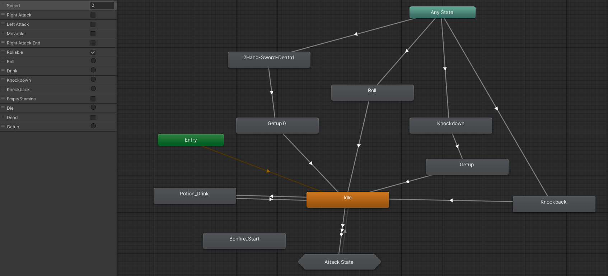
### Attack
각 애니메이션 상태에서 마우스 L,R 클릭 여부에 따라 State 이동
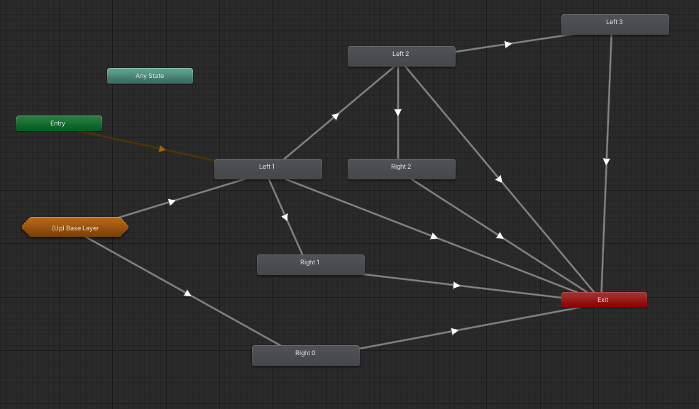

### Effect
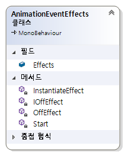

## Status
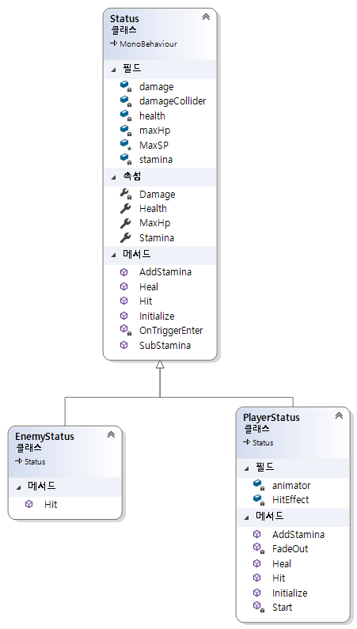

## Item
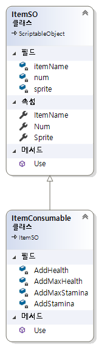

## Inventory
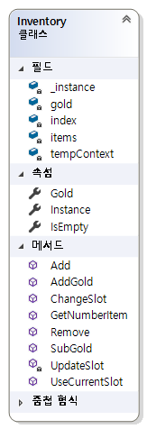

## UI
MVVM 패턴을 이용한 UI 구성  

#### Model
- Status
- Inventory

#### View Model
- Context

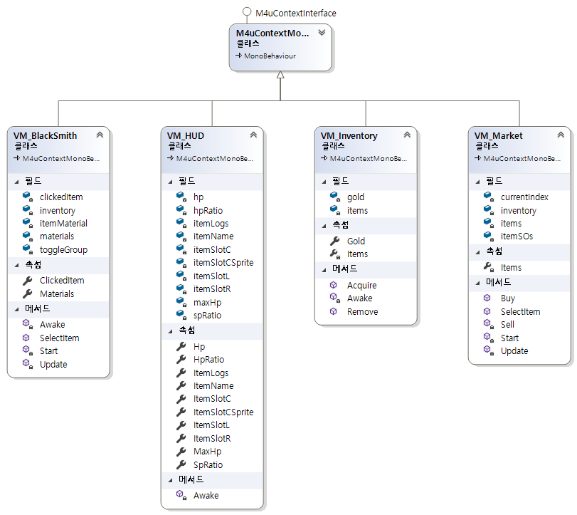

#### View
- HP, SP
- Item Slot
- Interactable Object Name
- Log
- Items in serveral popup
- ...

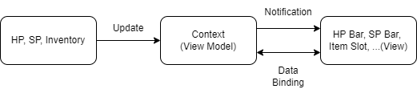
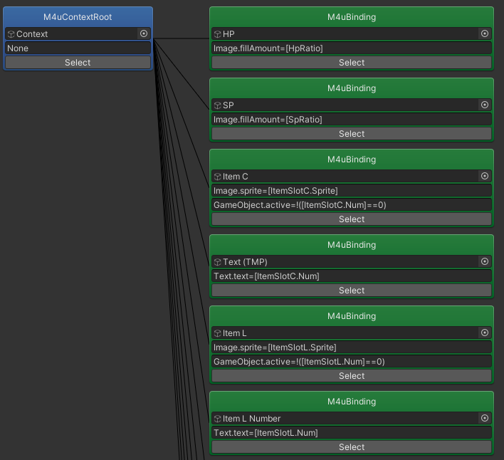
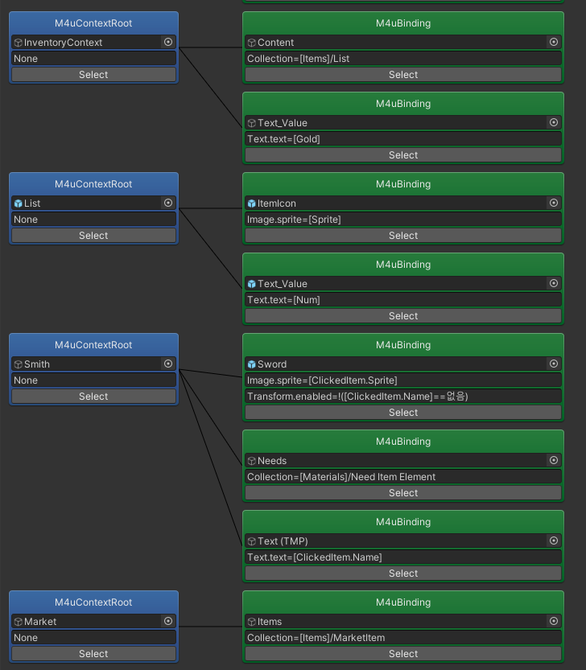
### Screen
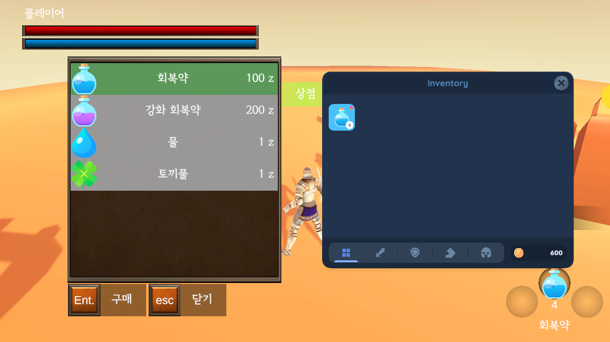

## ObjectPool
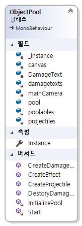

## Enemy
### Class
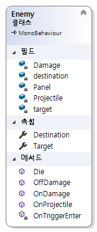

### Behaivor Tree
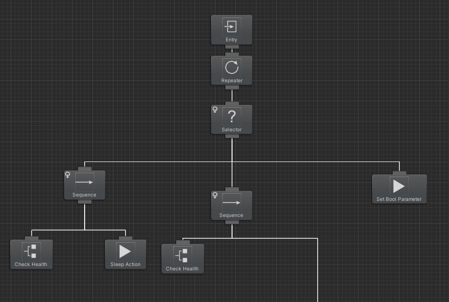
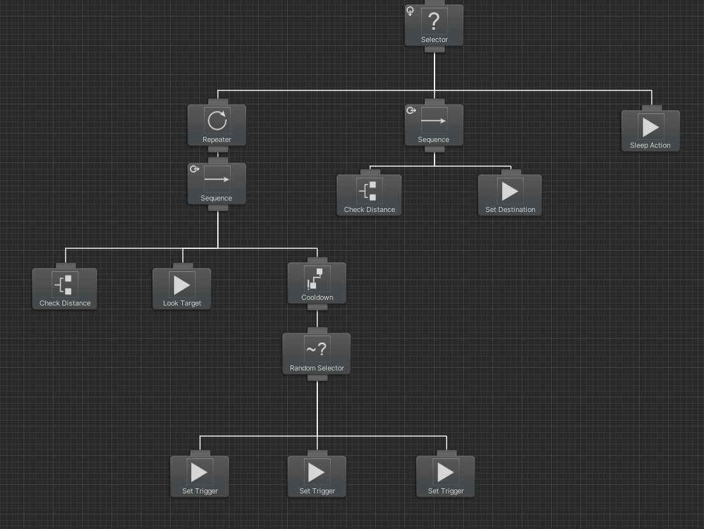