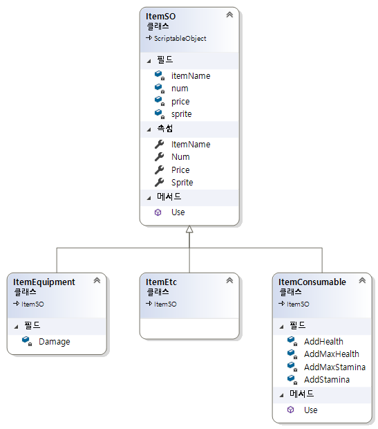
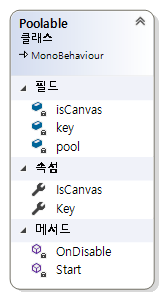

# 플로우 차트

# 클래스
1. [Player](#player)
2. [Status](#status)
3. [Item](#item)
4. [Inventory](#inventory)
5. [UI](#ui)
6. [Enemy](#enemy)
7. [NPC](#npc)

## Player

### Diagram

### Animation

### Attack
  
>각 애니메이션 상태에서 마우스 L,R 클릭 여부에 따라 State 이동

### Effect

## Status

## Item
  
>Scriptable Object로 각각의 아이템들을 정의함.

## Inventory

## UI
MVVM 패턴을 이용한 UI 구성  

### Model
- Status
- Inventory

### View Model
- Context
  
>Popup창마다, HUD인지에 따라 UI Context를 정의해서 각각 사용함.

### View
- HP, SP
- Item Slot
- Interactable Object Name
- Log
- Items in serveral popup
- ...

### Popup
  
>팝업창 관리하는 역할

### Screen

## ObjectPool
  
>주로 이펙트(데미지 텍스트, 투사체 이펙트)와 관련하여 ObjectPool를 생성하여 관리한다.  

  
>ObjectPool로 등록할 수 있는 인터페이스를 정의해서 사용함.  

## Enemy
전체적인 행동은 Behavior Tree에 따라 움직이고, Enemy Class는 Animation EventListener 역할을 주로 한다.
### Class

### Behaivor Tree
  
>1. 체력을 확인해 사망 상태인지 확인  
>2. 타겟이 존재하는지에 따라 행동할 것인지 가만히 있을 것인지  

>1. 타겟과의 거리를 확인한다.
>2. 거리가 멀 경우 타겟에게 다가간다.
>3. 거리가 가까우나 바라보는 방향이 다르면 바라본다.
>4. 랜덤 공격을 한다.

## NPC
  
>상호작용시 주로 팝업창을 띄워주는 역할을 한다.

### IInteraction
