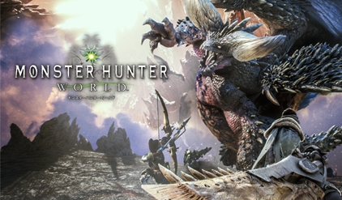
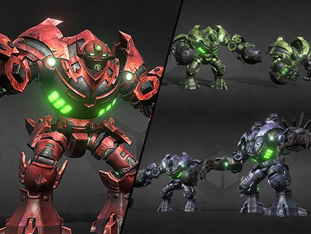

### 기반 게임
몬스터 헌터  

### 사용한 엔진
유니티 엔진

### 게임요소
- 대검을 휘두르는 플레이어
- 대검(가능하면 다른 무기도)을 휘두르는 플레이어 캐릭터
- 간단한 조작으로 콤보 스킬을 이용한 공격 (마우스 클릭만으로 공격)
- 다양한 패턴 공격을 하는 거대한 몬스터(가능하면 다양한 몬스터)
- 3인칭 시점
- 공격으로 사용할 수 있는 특수 맵 오브젝트 (ex.돌을 떨어뜨려 공격)
- 몬스터나 채집을 통한 아이템 제작 및 강화

### 개발 요소
- Player  

- Camera (3인칭)
- Player Status
- InputManager
- Enemy  

- Enemy AI (BT)
- Item
- Inventory
- MapObject  

