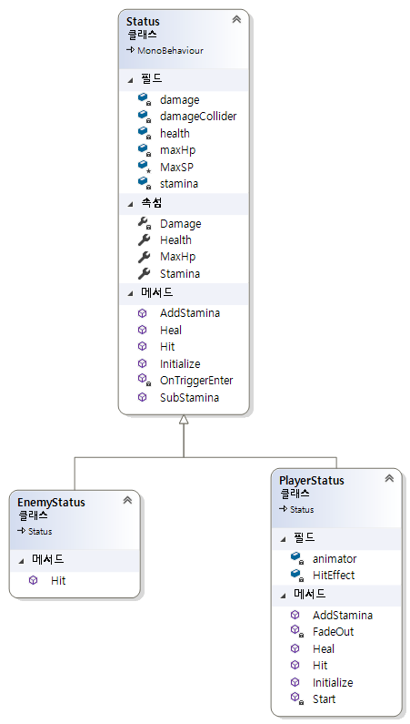
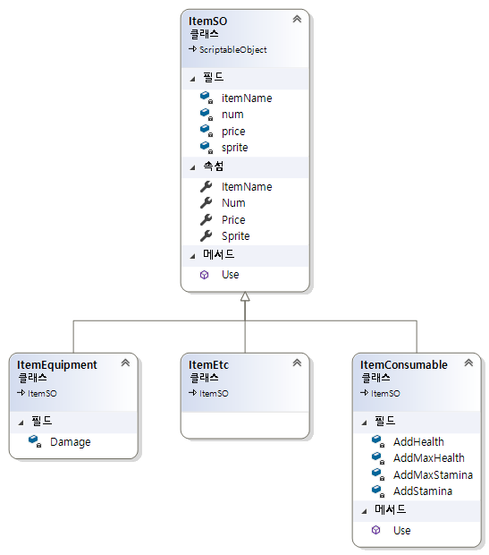

## 다이어그램
1. [Player](#player)
2. [Status](#status)
3. [Item](#item)
4. [Inventory](#inventory)
5. [Behaivor Tree](#behaivor-tree)
6. [UI](#ui)

### Player

### Status

### Item

### Inventory

### UI
MVVM 패턴을 이용한 UI 구성  

##### Model
- Status
- Inventory

##### View Model
- Context

##### View
- HP Bar
- SP Bar
- Item Slot
- Interactable Object Name
- Log

### ObjectPool
...

### Behaivor Tree

